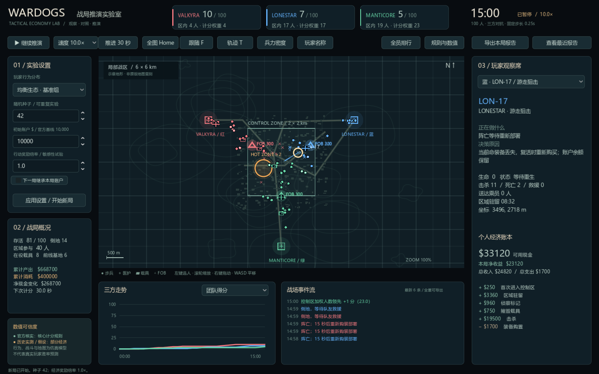

# WARDOGS 战争沙盘

基于 Godot 4.6 的三方战争与经济推演工具。以 P2 OPUS 的观察型沙盘为参考，在一张可缩放的战区地图上运行 100 名具有行为倾向的模拟玩家，观察红、蓝、绿三方的占区、交火、运输、救援、支援、现金收支与胜负。

这是**公开规则驱动、可校准的行为模型**。已核实的官方规则、社区实测值和模型假设分别标注；它不是官方完整数值复刻，也不预测真人服务器胜率。基线资料核查于 **2026-09-18，Early Access / Season 1**，详见 [规则证据与版本](docs/RULE_SOURCES.md)。

## Windows PC 下载

[下载 Windows x64 预览版 v0.1.0](https://github.com/solinzzz/wardog-sandbox/releases/tag/wardogs-sandbox-v0.1.0)。完整解压后运行 **WARDOGS_Sandbox.exe**，无需安装 Godot。保持 EXE 和同名 PCK 在同一目录。操作、构建方式及未签名程序的验收限制见 [Windows 发行说明](docs/WINDOWS_RELEASE.md)。

## 开始推演

Windows 双击工程根目录的 **启动沙盘.bat**，或者用 Godot 4.6 打开 project.godot 后按 F6/F5 运行。启动器优先使用本机 D:\software\Godot\Godot_v4.6.3-stable_win64_console.exe。

通用 PowerShell 入口可指定自己的 Godot 路径：

    .\tools\run.ps1 -Mode Play -Godot "C:\Tools\Godot\godot.exe"
    .\tools\run.ps1 -Mode Editor

也可设置环境变量 GODOT_PATH。Windows 启动脚本兼容 Windows PowerShell 5.1；启动无需网络连接，无需额外素材下载。

| 操作 | 功能 |
|---|---|
| 空格 / 暂停按钮 | 暂停、继续 |
| 速度菜单 / +、− | 0.25、1、4、10、30、100 倍速；默认 10 倍 |
| 推进 30 秒 | 暂停观察时推进一轮计分时间 |
| 鼠标滚轮 | 以鼠标位置为中心放大、缩小 |
| 右键或中键拖动 / WASD | 平移地图 |
| Home / 0 | 返回全图 |
| 左键点玩家 / Tab | 选择玩家，查看当前目标、决策原因与经济明细 |
| F | 聚焦选中玩家 |
| T / 轨迹开关 | 切换运动轨迹 |
| 侧边栏开关 | 显示名称、密度热度、跟随选中玩家 |
| 查看排行榜 | 按本局净收益观察全体玩家 |
| 导出本局报告 | 打开中文报告弹层并导出状态、配置、账本、事件、玩家 CSV 与趋势；Esc 返回 |

地图上的步兵、运输车、装甲车、运输直升机、FOB 都是模拟实体。飞机使用二维运输路线抽象。底部可切换三队分数、账户余额和占区人数曲线。热区现金与人数权重都是两倍。

## 三个对照场景

- **均衡生态 / balanced**：三队使用相近的占点、医疗、运输、工程、装甲、侦察与逐利倾向构成。
- **逐利生态 / profit**：提高三队逐利玩家比例，更积极争夺热区收益，也会顺路救援和低血量保本。
- **红队协同 / coordinated**：调整红队人员构成和目标集中程度，让其更集中争夺热区、救援与协作。红队没有额外命中或伤害加成。

这些“角色”是研究用行为倾向，不是游戏职业锁。玩家行为由状态、距离、生命值、现金、实际伤员和实际载具共同驱动。

建议先用同一个种子分别观察三个场景，再改变奖励倍率。选中运输司机可追踪乘客从上车到卸载；选中医疗玩家可追踪接近伤员、救援、恢复前线人数和收入。比较时同时看**团队得分**与**玩家净收益**，可以观察赚钱与取胜目标何时一致、何时冲突。

## 规则与数值

| 规则或数值 | 默认值 | 证据等级 |
|---|---|---|
| 玩家总数、阵营 | 100 人，红 Valkyra / 蓝 Lonestar / 绿 Manticore | 官方上限 100、三队；34/33/33 分配为模型设定 |
| 获胜 | 每 30 秒占区加权人数最多的一队 +1；先达 100 分胜 | 官方 |
| 热区 | 人数权重 ×2，现金奖励 ×2 | 官方 |
| 初始账户 | $10,000 | 官方；新账户一次发放 |
| FOB / Large Hammer | $7,500 / $2,400 购买价 | 官方 S1；不同于永久解锁费 |
| 个人占区收入 | $160 / 热区 $320，约每 24 秒 | 社区观察，计时近似 |
| 首次进入控制区 | $250 | 社区观察 |
| 击杀 | 区外 $300、控制区 $1,500、热区 $3,000；双方位置各占一半 | 社区观察 |
| Kodiak M249 / SPH-2 / MH-6 | $3,750 / $8,000 / $6,250 | 历史社区商店记录，未核实当前 S1 |
| 运输、复活、治疗、侦察、补给奖励 | 见 data/rules.json | 可修改的模型假设 |
| 装备价格、速度、血量、命中、射程、复活等待 | 见 data/rules.json 与核心脚本 | 模型假设 |
| 加权人数持平 | 本轮不发团队分 | 模型假设 |
| 最长推演 | 3 小时；未到 100 分则截尾未决 | 分析限制，不是官方赛制 |

队伍积分与个人现金使用**独立计时器**。净收益 = 本局收入 − 本局支出，账户余额 = 本局初始余额 + 净收益。购买装备和载具会真实扣款；死亡后重新购装，不会凭空补回余额。余额不足时使用免费的基本步兵包，属于防止破产死锁的模型假设。

运输收益必须有实际登车者、同一条生命、至少 600 米有效位移、抵达控制区并实际下车；空车、原地卸载和重复卸载没有收益。复活必须接近实际倒地队友，复活成功后才能记账。工程补给也需要采购、移动和实际交付。

## 参数与账户

界面可设置种子、三个场景、新账户初始现金与奖励倍率，点击开始新局生效。奖励倍率是实验覆盖值，会在报告中保留。data/rules.json 集中存储人口、基础经济、载具、计时器与证据状态；更细的策略、战斗与空间行为在 scripts/simulation.gd。

“下一局继承本局账户”将当前余额作为下一局初始余额，下一局购装照常扣款；它不会再发一次 $10,000。未勾选则每次是新的独立实验账户。继承仅在当前应用会话内衔接；本工具没有真实游戏账户连接和跨应用会话账号服务。

研究账户默认已经永久解锁装备。本版没有模拟 XP、等级门槛、永久解锁费、局末奖金和服务器人数现金缩放。默认关闭尚无可靠官方证据的 FOB 出生能力；FOB 补给和治疗仍是实验性后勤抽象。

地图是三基地近似等距的 6 × 6 km 局部研究地图，中央控制区为 2 × 2 km。它不是官方 256 km² 地图的真实地形。背景地形用于观察，不参与碰撞、寻路或视线判定。没有真人行为遥测、现实弹道、装甲穿深或建筑破坏仿真。

## 批量推演与导出

双击 **tools/批量推演.bat** 默认运行种子 42、43、44 × 三场景，共 9 局。每局独立账户，达到 100 分或 3 小时结束。一次完整 9 局运行可能需要数分钟，命令行逐局报告进度。

    .\tools\run.ps1 -Mode Batch
    .\tools\run.ps1 -Mode Batch -Seeds 5 -StartSeed 100 -MaxSeconds 10800
    .\tools\run.ps1 -Mode Batch -Seeds 1 -MaxSeconds 600 -Output "res://artifacts/short_batch"

可提供只包含待修改键的 JSON，批量工具递归合并到基础规则。例如保存 experiment.json 为 {"rewards":{"transport":300},"starting_cash":10000}：

    .\tools\run.ps1 -Mode Batch -Config "res://experiment.json" -Output "res://artifacts/transport_bonus"

默认输出在 artifacts/batch，重复运行会覆盖此目录内同名汇总文件：

| 文件 | 内容 |
|---|---|
| runs.csv / runs.json | 各局种子、场景、观察时长、比分、胜者或截尾结果、总收入与成本 |
| roles.csv | 各局各角色每人平均收入、支出、净收益、击杀、死亡、救援、运输和占区时间 |
| aggregate.json / REPORT.md | 各场景已决、截尾、三队胜场及样本均值 |
| metadata.json | 配对种子、参数覆盖、最长时长、耗时及解释限制 |
| rules_snapshot.json | 本次实验完整基础配置和数值来源状态 |

相同种子可重复同一场景的结果；场景改变角色构成后，也可能改变随机数消费顺序，因此“配对种子”不意味着严格共同随机数统计实验。少量场次的胜场分布仅用于检查模型，不代表真实游戏胜率。**超时局单列为截尾，不计胜利，也不作为平局胜率；不同观察时长的总收入应谨慎直接比较。**

交互界面的完整本局报告写到 Godot user://reports/run_*。点击“查看最近报告”可打开实际目录，其中包括：

- **报告.txt**：中文三方对照、七种行为倾向人均净收益、收入与成本来源汇总。
- **players.csv**：全体玩家的收支、战斗、救援、运输与占区记录。
- **summary / rules / history / actors / ledger / events JSON**：汇总、完整参数、趋势、玩家状态、逐笔收支与事件，支持复盘追溯。

批量输出只保留紧凑汇总，避免多局逐笔账本占用大量空间。

## 验证

    .\tools\run.ps1 -Mode Test

或双击 **tools/运行验证.bat**。已在 Godot 4.6.3 下完成 **37/37 项检查**，结果保存在 artifacts/test_report.json；失败返回非零退出码。

另已完成种子 42–44 × 三场景的 **9 局完整推演**：全部正常达到 100 分，所有玩家账户守恒，耗时约 365 秒。均衡场景红/蓝/绿胜场为 2/0/1，逐利场景为 1/2/0，红队协同场景为 3/0/0；这些仅是当前模型的检查样本。详见 [批量验收报告](artifacts/batch/REPORT.md)。还单独验证了 60 秒截尾分支：未到胜利条件时 winner=-1、胜场数为零。

检查涵盖人口分配、确定性种子、不同播放步长一致、30 秒计分、热区权重、平局不得分、24 秒现金独立时钟、首次入区只付一次、逐笔及全队账本守恒、实际运输与救援、防重复奖励、100 分终局停止、长局正常结束、超时截尾以及账户继承隔离。

有图形渲染的环境还可以运行以下命令：

    godot --path . -- --ui-test
    godot --path . -- --smoke-test

UI 检查已覆盖地图实际点击选人、鼠标锚点缩放、拖拽、跟随、30 秒单步、报告生成、余额继承和重复应用参数不累乘。冒烟检查生成 artifacts/wardogs_sandbox.png。

## 工程结构

- scripts/simulation.gd：固定 0.25 秒步长核心；行为、载具、交战、经济账本与胜负。
- scripts/main.gd、map_view.gd、chart.gd：观察面板、地图与趋势。
- scripts/report.gd：中文复盘报告和角色经济分析。
- data/rules.json：经济和规则参数，逐类证据状态。
- docs/RULE_SOURCES.md：公开来源、版本、官方/社区/假设边界。
- tests/test_simulation.gd：无窗口验证。
- tools/batch.gd：无窗口多场景配对推演。
- artifacts/：截图、测试报告与紧凑批量结果。

本仓库为独立的 WARDOGS 沙盘工程，project.godot 位于仓库根目录。

